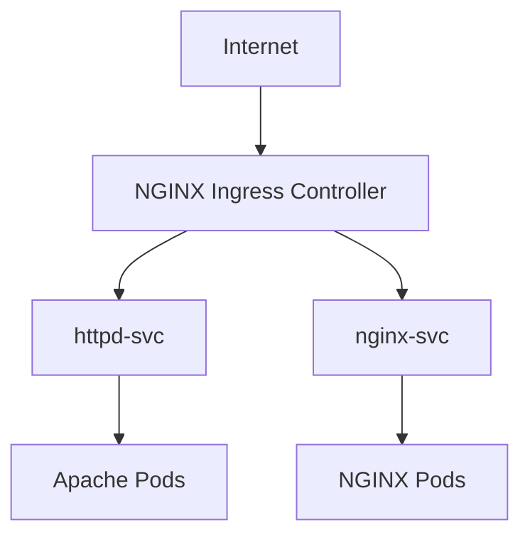
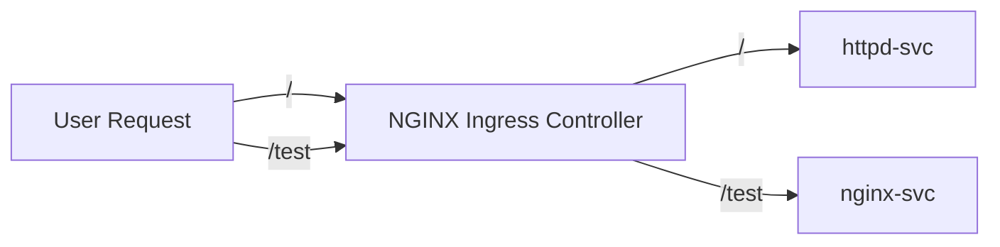

## What is Ingress?

Ingress is a Kubernetes resource that manages external access to services within a cluster.

It provides:

* Path-Based Routing
* Host-Based Routing
* SSL/TLS Termination
* Centralized Traffic Management

Instead of exposing every application using a separate LoadBalancer Service, Ingress allows multiple applications to be accessed through a single entry point.

---

## What is an Ingress Controller?

An Ingress resource only defines routing rules.

An **Ingress Controller** is responsible for implementing those rules and routing traffic to the appropriate backend services.

In this lab, we will use the **NGINX Ingress Controller**.

---

## Why Use Ingress?

Without Ingress:

```text
Internet
   |
   |
------------------
|                |
v                v

LB Service    LB Service
   |              |
   v              v

App-1         App-2
```

With Ingress:

```text
Internet
    |
    v

Ingress Controller
        |
    ----------
    |        |
    v        v

 App-1    App-2
```

Benefits:

* Single Entry Point
* Reduced Cost
* Easier Management
* Centralized Routing

---

## Lab Architecture



---

## Traffic Flow Used in This Lab


---

## Learning Objectives

After completing this lab, you will be able to:

* Deploy an NGINX Ingress Controller
* Create Ingress Resources
* Configure Path-Based Routing
* Route Traffic to Multiple Applications
* Verify and Troubleshoot Ingress Connectivity

---


## Task 1 -  Deploy nginx-ingress-controller

deploys the nginx-ingress-controller using the YAML manifest provided in the URL
```
kubectl apply -f https://raw.githubusercontent.com/kubernetes/ingress-nginx/controller-v1.1.0/deploy/static/provider/cloud/deploy.yaml
```
Verify Deployment and pods in the namespace:
```
kubectl get ns
```
```
kubectl -n ingress-nginx get all
```
View Controller Logs, If needed, view the logs of the nginx-ingress-controller pod(optional):
```
kubectl logs <nginx-ingress-controller-pod-name> -n ingress-nginx
```
change the service type of ***ingress-nginx-controller*** to ***NodePort*** If LoadBalancer is not intergrate with cluster

```
kubectl -n ingress-nginx edit svc ingress-nginx-controller
```
Verify the service type change 
```
kubectl -n ingress-nginx get svc
```

#### Create a Namespace and Deploy Applications:
creates a new namespace named ***ingress-ns*** for the application deployment:  
```
kubectl create ns ingress-ns
```
Deploy Httpd and Nginx deployments:
```
kubectl -n ingress-ns create deployment httpd-dep --image httpd --port 80 --replicas 2
```
```
kubectl -n ingress-ns create deployment nginx-dep --image nginx --port 80 --replicas 2
```
Verify the deployied application:
```
kubectl -n ingress-ns get deploy
```
```
kubectl -n ingress-ns get pods
```

Expose the deployments as services:
```
kubectl -n ingress-ns expose deployment httpd-dep --port 80 --name httpd-svc

```
```
kubectl -n ingress-ns expose deployment nginx-dep --port 8080 --name nginx-svc
```

Verify the created services and their end points:
```
kubectl -n ingress-ns get svc
```
```
kubectl -n ingress-ns get ep
```
#### Set Up Ingress Rules
Create a file named ***ingressrule.yaml*** and copy the provided Ingress rule configuration into it:

```
vi ingressrule.yaml
```

```yaml
apiVersion: networking.k8s.io/v1
kind: Ingress
metadata:
 annotations:
    nginx.ingress.kubernetes.io/rewrite-target: /$2
 namespace: ingress-ns
 name: rewrite
spec:
 ingressClassName: nginx
 rules:
 - http:
    paths:
    - path: /
      pathType: Prefix
      backend:
       service:
         name: httpd-svc
         port:
          number: 80
    - path: /test
      pathType: Prefix
      backend:
       service:
         name: nginx-svc
         port:
          number: 8080
```
Apply the Ingress rule configuration from the file:
```
kubectl apply -f ingressrule.yaml
```
Verify the created Ingress:
```
kubectl -n ingress-ns get ingress
```
```
kubectl -n ingress-ns describe ingress
```

#### Verify Ingress Connectivity
Note down the ***Ingress Address*** from the previous step and run the following command
```
curl -kv <ingress-address>/
```
i.e curl 10.107.154.147/test
```
curl -kv <ingress-address>/test
```
OR you can verfy the ingress connectivity with applications in the browser as well
copy the ***Public IP address*** of the node where ingress controller is deployed and paste into the borwser along with ***NodePort number*** and ***prefix***
```
kubectl -n ingress-ns get pods -o wide
```
> https://<"Public-IP-Of-The-Node">:<"NodePort-Number">/test 
| i.e : |
> https://35.182.151.251:32289/test  AND  https://35.182.151.251:32289/test 

## Task 2 - Cleanup all resources created in the above steps
```
kubectl delete ns ingress-ns
```
Deleting namespace will delete all the resources holding by it
Now delete the ingress-controller: 
```
kubectl delete -f https://raw.githubusercontent.com/kubernetes/ingress-nginx/controller-v1.1.0/deploy/static/provider/cloud/deploy.yaml
```
Verify the cleanup: 
```
kubectl get ns
```
