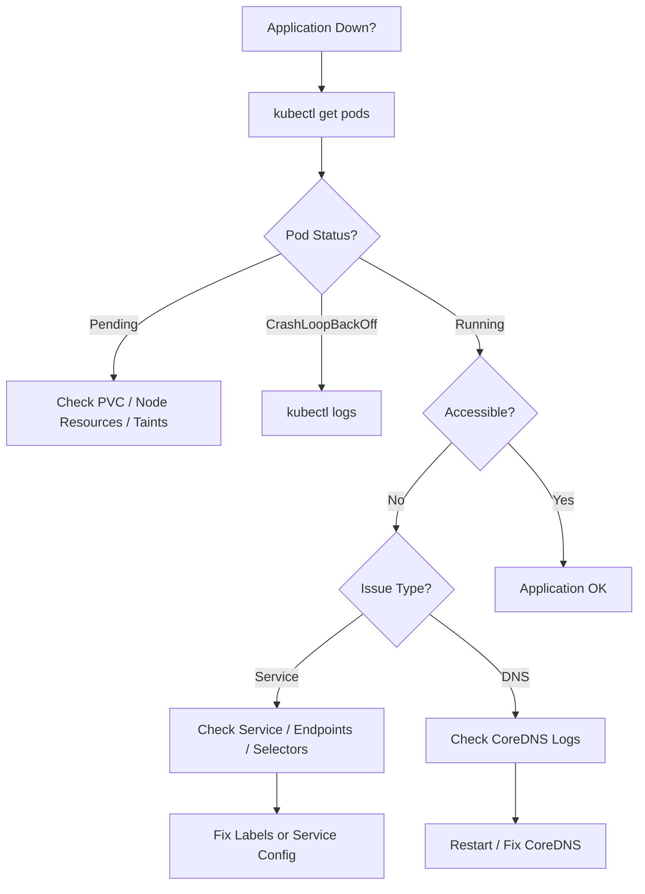
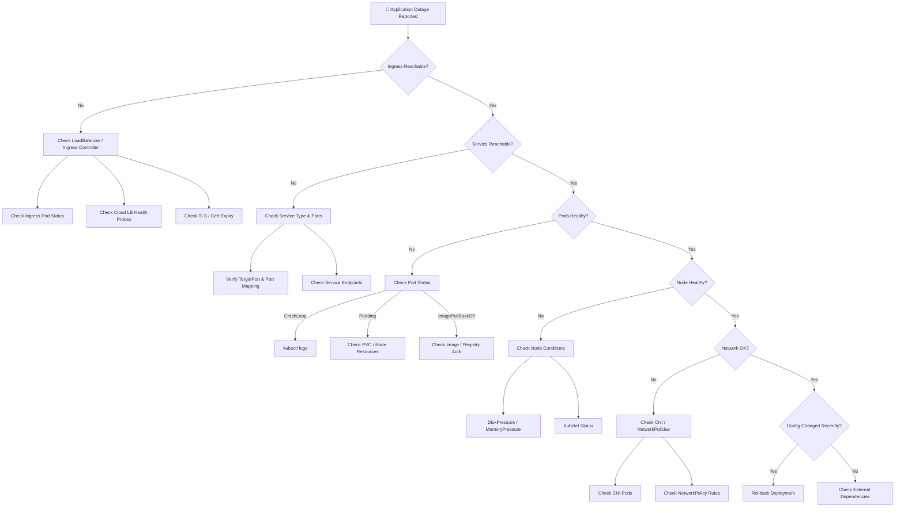
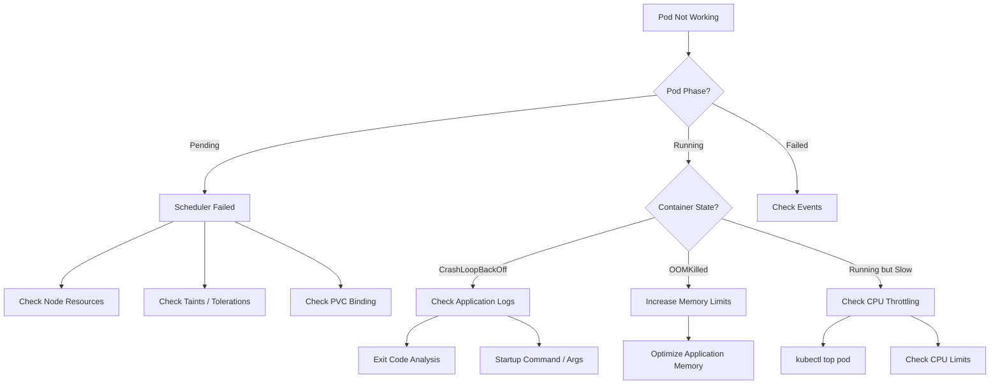
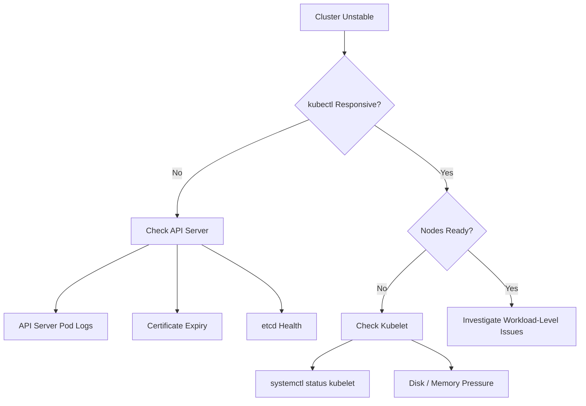

# Kubernetes Troubleshooting – Complete Hands-on LAB 

## Introduction

Troubleshooting is one of the **most important skills** for a Kubernetes engineer.  
In real-world environments and in the **CKA exam**, you are expected to **quickly identify, isolate, and fix issues** using Kubernetes-native tools.

This lab provides **practical troubleshooting exercises**, **exam-style scenarios**, **decision flowcharts**, and **real production incident simulations**.

---

## 🎯 Learning Objectives

By completing this lab, you will be able to:

- Evaluate cluster and node logging
- Monitor applications
- Manage container stdout & stderr logs
- Troubleshoot application failures
- Troubleshoot cluster component failures
- Troubleshoot Kubernetes networking issues

---

# Task 1: Evaluate Cluster and Node Logging

## Objective
Understand where logs are generated and how to analyze:
- Pod logs
- Node logs
- Control plane logs

---

### Step 1: List Cluster Nodes
```bash
kubectl get nodes -o wide
```
### Step 2: Describe a Node
```
kubectl describe node <node-name>
```

**Check for:**
- Ready / NotReady status
- DiskPressure
- MemoryPressure
- NetworkUnavailable

### Step 3: List System Pods
```
kubectl get pods -n kube-system
```
### Step 4: View Control Plane Logs
```
kubectl logs -n kube-system <pod-name>
```

### Step 5: Node-Level Logs (Conceptual)

Common log locations on a Kubernetes node:
```
/var/log/syslog
/var/log/messages
/var/log/kubelet.log
```

## Task 2: Monitoring Applications
Objective : Monitor application health and resource usage.

### Step 1: Deploy a Sample Application
```
kubectl create deployment nginx --image=nginx
kubectl expose deployment nginx --port=80
```

### Step 2: Check Pod Status
```
kubectl get pods
```

### Step 3: Describe Pod
```
kubectl describe pod <pod-name>
```
**Focus on:**
- Events section
- Restart count
- Scheduling or image pull errors

### Step 4: Monitor Resource Usage
```
kubectl top pods
kubectl top nodes
```

## Task 3: Manage Container stdout & stderr Logs
Objective: Understand how Kubernetes captures application logs.

### Step 1: Create a Logging Pod
```
kubectl run logger --image=busybox --restart=Never -- sh -c "while true; do echo Hello; sleep 5; done"
```

### Step 2: View and Stream Logs
```
kubectl logs logger
kubectl logs -f logger
```

### Step 3: stderr Example
```
kubectl run error-pod --image=busybox --restart=Never -- sh -c "ls /notfound"
kubectl logs error-pod
```

## Task 4: Troubleshoot Application Failure
Objective: Identify and fix crashing containers.

### Step 1: Create a Failing Pod
```
kubectl run crash-pod --image=busybox --restart=Never -- sh -c "exit 1"
```

### Step 2: Check Pod Status
```
kubectl get pods
```

Expected: `CrashLoopBackOff`

### Step 3: Investigate Failure
```
kubectl describe pod crash-pod
kubectl logs crash-pod
```

### Step 4: Fix the Issue
```
kubectl delete pod crash-pod
kubectl run fixed-pod --image=busybox --restart=Never -- sleep 3600
```

## Task 5: Troubleshoot Cluster Component Failure
Objective: Identify failures in Kubernetes control plane components.

### Step 1: Check Control Plane Pods
```
kubectl get pods -n kube-system
```

### Step 2: Investigate a Failing Component
```
kubectl describe pod <system-pod> -n kube-system
kubectl logs <system-pod> -n kube-system
```
**Common Root Causes**
- kubelet service down
- etcd disk full
- Certificate expiry
- API server unreachable

## Task 6: Troubleshoot Networking
Objective: Diagnose pod-to-pod, pod-to-service, and DNS issues.

### Step 1: Create Test Pods
```
kubectl run pod-a --image=busybox --restart=Never -- sleep 3600
kubectl run pod-b --image=busybox --restart=Never -- sleep 3600
```

### Step 2: Pod-to-Pod Connectivity Test
```
kubectl exec -it pod-a -- ping pod-b
```

### Step 3: Service Connectivity Test
```
kubectl create deployment web --image=nginx
kubectl expose deployment web --port=80
kubectl exec -it pod-a -- wget -qO- http://web
```

### Step 4: DNS Resolution Test
```
kubectl exec -it pod-a -- nslookup web
```
---

## Troubleshooting Scenarios

### Scenario 1: Pod Stuck in Pending

**Possible Causes:**
- PVC not bound
- Insufficient node resources
- Node taints
```
kubectl describe pod <pod-name>
```

### Scenario 2: Service Not Reachable

**Possible Causes:**
- Selector mismatch
- No endpoints
- Pod not Ready
```
kubectl get endpoints <service-name>
```

### Scenario 3: Node NotReady

**Possible Causes:**
- kubelet stopped
- Disk pressure
- Network issues
```
kubectl describe node <node-name>
```
---

#### Troubleshooting Decision Flowchart


---

### Advanced Kubernetes Application Outage – Decision Tree
**Use Case**
- Production app is down
- Users report timeouts / 5xx errors
- Multiple layers involved (Ingress, Service, Pods, Node)



### Deep Pod Lifecycle & Runtime Failure Flow
**Use Case**
- Pod stuck or unstable
- Works in dev but fails in prod
- Resource & runtime issues



#### Control Plane & etcd Failure  



---

## Real Production Incident Simulations

### Incident 1: Pods Restarting Frequently

**Cause:**
Memory limit exceeded (OOMKilled)

**Resolution:**
- Increase memory limits
- Optimize application memory usage

### Incident 2: DNS Resolution Failure

**Cause:**
CoreDNS crash or misconfiguration

**Resolution:**
```
kubectl rollout restart deployment coredns -n kube-system
```

### Incident 3: Node Disk Full

**Cause:**
Log accumulation or unused images

**Resolution:**
- Clean disk space
- Enable log rotation
- Increase node disk size


### Always start troubleshooting with:
```
kubectl get pods
kubectl describe pod
kubectl logs
```
- Kubernetes usually reports the issue in Events
 
